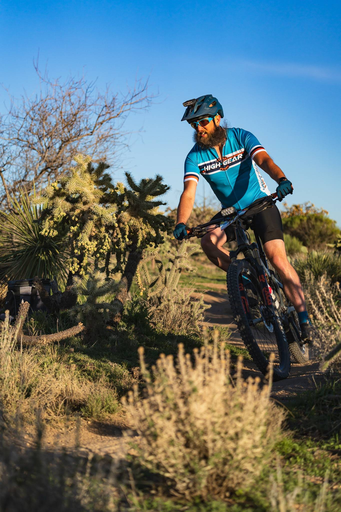

Hello and welcome to my little webpage! I am a seasoned IT professional, currently working as a senior systems administrator and working towards completing my bachelor's degree. I have called Prescott, Arizona home for almost 25 years after spending most of my childhood down in Phoenix.

I love the outdoors and try to spend as much time as I possibly can outside in nature. I grew up outside, running, biking, swimming, hunting, fishing, and backpacking and have tried to continue that lifestyle into adulthood. I have included a small picture gallery highlighting some of my more recent adventures for you to enjoy in the Photography section.

Volunteering and helping others is also a big part of who I am. I have been a proud member of the [Prescott Sunrise Lions Club](https://www.prescottsunriselionsclub.org/) for the last 18 years, serving in just about every possible capacity. I have also spent the last few years volunteering as a coach for the Basis Prescott Mountain Bike team during the summer and fall and for the Team High Gear mountain bike team during the winter and spring months. Working with the kids on these teams has been a great joy in my life and I hope to be able to continue to ride with them as long as my body will let me. 

Over the years, I have also developed a fondness for experimenting with food and beverages. I always have something fermenting in my pantry or dedicated fermentation chamber and bake sourdough bread weekly. My fun little homebrewing hobby has certainly expanded to become much bigger than I could have ever anticipated. Speaking of homebrewing, I have included a page with some of my favorite beer recipes for you to try out for yourself. I recently started experimenting with brewing N.A. beers and hope to be able to include a couple non-alcoholic recipes here soon too!

-Scott